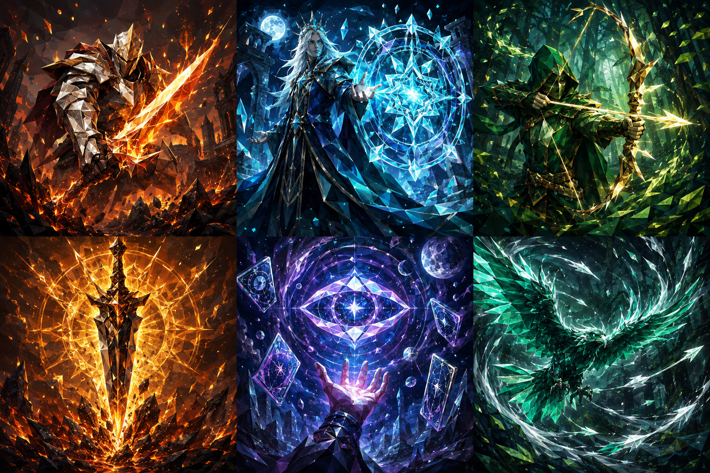

# Astra the Spire · 星烬

一款运行在浏览器中的单角色、单副牌 3D 卡牌爬塔游戏。选择角色，规划 15 层随机路线，在战斗、事件、商店与营火之间做出取舍，最终挑战领主。



## 游戏特色

- 三名角色、三套独立牌池与不同的初始遗物
- 15 层种子化分岔地图，包含普通战、精英、事件、商店、营火与宝箱
- Three.js 实时低多边形角色、四类区域场景与漫画式技能演出
- 点击或拖拽出牌、键盘快捷键和移动端横屏操作
- 元素蓄能大招、遗物、卡牌升级与跨房间成长
- 本地存档、机制回归测试与完整路线模拟

## 快速开始

需要 Node.js 20.10+、npm，以及支持 WebGL 的现代浏览器。

```bash
git clone https://github.com/B1lli/Astra-the-spire.git
cd Astra-the-spire
npm install
npm run dev
```

Vite 启动后会在终端显示本地访问地址。生产构建与预览：

```bash
npm run build
npm run preview
```

## 游戏流程

开始或继续游戏 → 三选一角色 → 获得初始遗物与祝福 → 探索 15 层随机分岔地图 → 挑战领主 → 胜负结算。

地图只能沿连线前进，但可以提前查看后续路线。角色仅使用自己的牌池；生命、金币、牌组、升级与遗物会跨房间保留。

| 角色 | 生命 | 初始遗物 | 核心打法 |
| --- | ---: | --- | --- |
| 凯尔 | 80 | 战后回复 6 | 易伤、燃烧与终结 |
| 莉娅 | 70 | 每回合首张技能抽 1 | 过牌、护盾与法术 |
| 希尔 | 72 | 每回合每 3 张攻击获得 5 格挡 | 多段攻击与残像 |

基础回合拥有 3 点能量并抽 5 张牌。手牌上限为 10；回合结束时弃牌，抽牌堆耗尽后将弃牌堆洗回。战后卡牌奖励可以跳过，精英战额外提供遗物；营火可回复 30% 最大生命或升级一张牌。

## 操作

| 操作 | 鼠标 / 触屏 | 键盘 |
| --- | --- | --- |
| 选择卡牌 | 点击卡牌 | 数字键 |
| 对敌出牌 | 点击卡牌后点击敌人，或拖向敌人 | `Enter` |
| 取消选择 | 右键 | `Esc` |
| 结束回合 | 点击结束回合 | `E` |
| 释放大招 | 点击能量旁的大招按钮 | `Q` |

手机端可横向滑动手牌并向上拖动出牌。自身技能和群攻牌无需选择敌人。工具栏可以调整镜头、声音与游戏速度；游戏也会尊重系统的“减少动态效果”设置。

## 元素大招

出牌会按费用积攒元素，零费牌至少积攒 1 格，上限 6 格。蓄能跨回合保留，每场战斗从 0 开始；蓄满后释放大招不消耗行动能量或手牌。

- 凯尔「陨日天坠」：对全体造成 28 点伤害，存活敌人获得 3 层燃烧。
- 莉娅「苍穹星葬」：对全体造成 18 点伤害，自身获得 12 点格挡。
- 希尔「万刃归岚」：对全体造成 5 段、每段 5 点伤害。

主菜单的“大招试演”可以直接体验三名角色的完整演出。试演不会读取或覆盖正常存档。

## 美术与演出

游戏使用黑、纸白与钴蓝作为主视觉，并以朱红、钴蓝、松绿区分三名角色。Three.js 程序化模型包含分层服装、护甲、面部、发型和专属武器；大招与特殊卡牌具有漫画分镜、慢动作、命中停顿、冲击波和地裂等演出。

15 层路线会依次经过沙漠、荒原、草原与森林，共包含 12 种实时 3D 场景。区域色卡与设计说明见 [环境美术文档](docs/environment-art.md)，无字卡面原稿与生成提示词见 [`public/art/PROMPTS.md`](public/art/PROMPTS.md)。

## 开发与验证

```bash
npm test          # 运行机制回归测试
npm run simulate  # 模拟三名角色的完整路线
```

主要模块：

- `src/data.js`：角色、卡牌、牌组与遗物数据
- `src/route.js`：基于种子的有向路线生成
- `src/roguelike.js`：纯状态引擎、战斗与房间流程
- `src/tower.js`：界面、指向操作、存档与演出调度
- `src/scene.js`：角色建模、场景、镜头与特效
- `src/biomes.js`、`src/biome-world.js`：区域色卡、楼层映射、地形与地标
- `tests/`：机制回归与完整路线模拟
- `docs/experience-audit.md`：完整体验流程审查

存档键为 `astral-ash-tower-v3`。使用 `/?practice=1` 可以启动不覆盖正常存档的临时测试对局。字体会联网加载，离线时回退至系统字体；游戏逻辑、模型和卡面资源均保存在本地。

## 参与贡献

欢迎通过 Issue 报告问题或提出建议。提交代码前，请先运行：

```bash
npm test
npm run build
```

建议让每个 Pull Request 聚焦一个主题，并清楚说明玩法变化、验证方式及界面改动；视觉改动可附带截图或录屏。

## 许可证

本仓库目前尚未添加开源许可证。代码可以公开查看，但在许可证确定前，不自动授予复制、修改或再分发权利。
